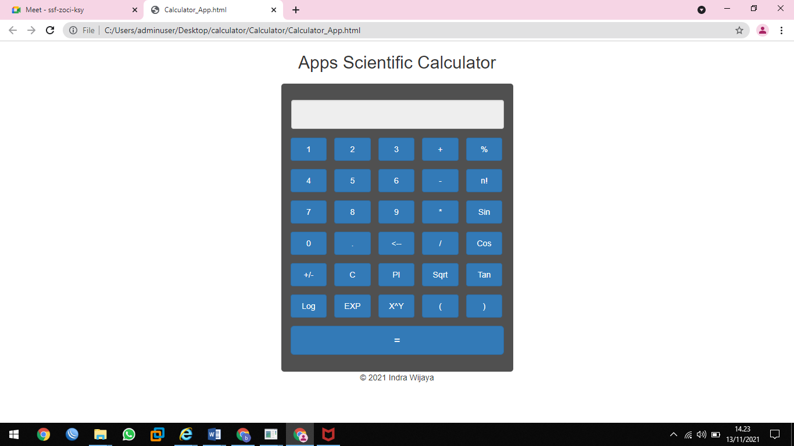

# CalculatorApp 

ini adalah aplikasi kalkulator pada javascript,
yang fungsi javascriptnya ada dalam nama file eksternal
"calculator.js" di folder js.

## Fitur Aplikasi ini

* Ini responsif
* Ini adalah Kalkulator ilmiah dengan sebagian besar fitur fungsi di dalamnya

Ini adalah tangkapan layar aplikasi..

